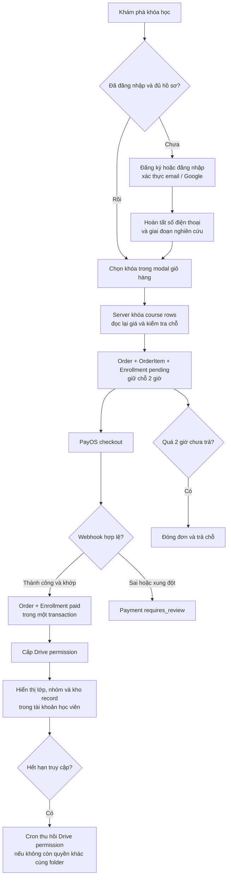
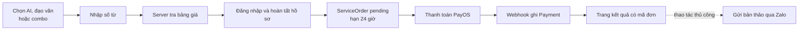
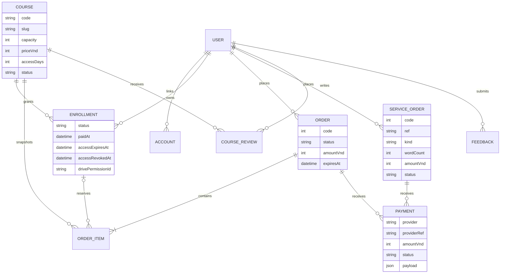
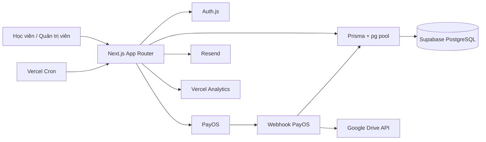

# HDI Research Center

Nền tảng web cho HDI Research Center, kết hợp website học thuật, catalog khóa học, bán khóa học có giới hạn chỗ, cấp học liệu qua Google Drive và dịch vụ kiểm tra AI/đạo văn theo đơn.

Ứng dụng được xây dựng bằng Next.js và PostgreSQL. Giá, chỗ học, trạng thái thanh toán và quyền truy cập được quyết định ở server; PayOS xác nhận tiền, còn Google Drive kiểm soát email nào thực sự xem được học liệu.

## 1. Vấn đề và bối cảnh domain

HDI phục vụ sinh viên, học viên cao học, nghiên cứu sinh, giảng viên và nhà nghiên cứu trẻ ở nhiều giai đoạn khác nhau: hình thành đề tài, chọn phương pháp, phân tích dữ liệu, viết bản thảo và chuẩn bị công bố.

Nhu cầu của website vì vậy không dừng ở một landing page giới thiệu hồ sơ học thuật. Hệ thống còn phải xử lý những công việc có trạng thái và ràng buộc rõ ràng:

1. Giới thiệu HDI, đội ngũ, công bố, hội thảo, dịch vụ và lộ trình khóa học.
2. Mở bán khóa học theo sức chứa thực tế, không để hai người cùng mua chỗ cuối.
3. Tính tiền ở server, tạo đơn và xác nhận giao dịch qua PayOS.
4. Chỉ hiển thị link lớp, cộng đồng và kho record cho học viên còn quyền truy cập.
5. Tự cấp hoặc thu hồi quyền Google Drive theo vòng đời ghi danh.
6. Nhận đơn kiểm tra AI/đạo văn theo số từ và lưu chung bằng chứng thanh toán với đơn khóa học.
7. Cho học viên xem lại đơn, khóa đã mua, thời hạn truy cập và gửi đánh giá.
8. Cho quản trị viên theo dõi đơn, đối soát giao dịch bất thường, duyệt đánh giá, xử lý góp ý và sửa quyền Drive bị thiếu.

### Business rules

| Rule | Yêu cầu hệ thống phải đảm bảo |
| --- | --- |
| BR-01 | Chỉ webhook PayOS có chữ ký hợp lệ mới được xác nhận thanh toán. Mã kết quả, số tiền, đơn vị tiền, thời điểm, payment link và trạng thái ghi danh đều phải nhất quán. |
| BR-02 | Trình duyệt chỉ gửi ID khóa học hoặc thông tin báo giá. Giá khóa học và dịch vụ luôn được tính lại ở server. |
| BR-03 | Một đơn khóa học có thể chứa nhiều khóa. Việc kiểm tra toàn bộ giỏ, giữ chỗ và tạo các ghi danh diễn ra trong một transaction. |
| BR-04 | Đơn khóa học `pending` giữ chỗ trong 2 giờ. Đơn hết hạn phải đóng và trả lại chỗ cho người khác. |
| BR-05 | Một học viên không thể đồng thời có hai ghi danh đang chờ hoặc còn quyền cho cùng một khóa. Chỉ sau khi quyền cũ được thu hồi thành công mới có thể mua lại. |
| BR-06 | Thanh toán thành công đổi đơn và tất cả ghi danh liên quan sang `paid` trong cùng transaction, đồng thời tính ngày hết hạn từ chính sách của khóa. |
| BR-07 | Khi một ghi danh hết hạn, hệ thống chỉ xóa Drive permission nếu người đó không còn ghi danh hợp lệ khác dùng cùng thư mục. |
| BR-08 | Webhook gửi lặp không được xác nhận đơn hoặc cấp quyền lần thứ hai. Khóa `(provider, providerRef)` là chốt idempotency dùng chung toàn hệ thống. |
| BR-09 | Mỗi payment thuộc đúng một đơn khóa học hoặc một đơn dịch vụ. Giao dịch sai số tiền, quá hạn hoặc xung đột reference được giữ ở `requires_review`, không tự cấp quyền. |
| BR-10 | Link lớp, link cộng đồng và Drive folder chỉ được đọc cho những khóa mà tài khoản hiện còn quyền truy cập. |
| BR-11 | Đơn kiểm tra AI/đạo văn thuộc về một tài khoản, có URL ngẫu nhiên và sống 24 giờ. Sau khi thanh toán, học viên gửi bản thảo qua Zalo kèm mã đơn. |

Các rule trên buộc solution phải phối hợp ba nguồn trạng thái: dữ liệu nghiệp vụ trong PostgreSQL, kết quả thanh toán tại PayOS và quyền đọc thực tế tại Google Drive.

## 2. Solution này là gì

HDI Research Center là một ứng dụng Next.js nối hai hành trình chính:

- **Khóa học:** khám phá nội dung → đăng nhập → hoàn tất hồ sơ → chọn khóa → giữ chỗ → thanh toán → ghi danh → cấp học liệu → thu hồi khi hết hạn.
- **Kiểm tra AI/đạo văn:** chọn loại kiểm tra → nhập số từ → nhận báo giá → thanh toán → lấy mã đơn → gửi bản thảo qua Zalo.

| Nhu cầu | Cách solution xử lý | Dữ liệu kiểm tra |
| --- | --- | --- |
| Website học thuật | Nội dung có cấu trúc cho HDI, đội ngũ, công bố, hội thảo, dịch vụ và khóa học | `content/*.ts` và các route trong `app/` |
| Bán khóa có giới hạn chỗ | Khóa dòng course theo thứ tự cố định, đếm ghi danh đang giữ chỗ/quyền rồi tạo một order cho cả giỏ | `Course`, `Order`, `OrderItem`, `Enrollment` |
| Theo dõi tiền | Lưu từng sự kiện PayOS cùng payload gốc; các giao dịch không nhất quán đi vào hàng chờ đối soát | `Payment` |
| Cấp học liệu | Sau payment thành công, cấp Google Drive permission cho email của học viên và lưu permission ID | `Enrollment.drivePermissionId` và Google Drive |
| Giới hạn thời gian học | Tính `accessExpiresAt` khi xác nhận payment; cron thu hồi quyền khi hết hạn | `Course.accessDays` và `Enrollment` |
| Kiểm tra AI/đạo văn | Báo giá theo loại dịch vụ và số từ, tạo service order, thanh toán qua cùng PayOS | `ServiceOrder` và `Payment` |
| Khu vực học viên | Hiển thị ghi danh, link lớp/nhóm/Drive, đơn dịch vụ, lịch sử đơn và form đánh giá | `/tai-khoan` |
| Vận hành | Dashboard quản trị đơn, ghi danh, khóa học, payment bất thường, review, feedback và Drive | `/quan-tri` |

### 2.1. Hành trình mua khóa học



Giỏ hàng chỉ là cookie chứa tập `Course.id`; cookie không chứa giá và không cấp quyền. Order chỉ được tạo sau khi server đọc lại catalog, khóa các dòng cần thiết và xác nhận toàn bộ giỏ vẫn hợp lệ.

### 2.2. Hành trình dịch vụ kiểm tra AI/đạo văn



Solution hiện tự động phần báo giá, tạo đơn, thu tiền và lưu lịch sử. Việc nhận file, thực hiện kiểm tra và trả kết quả vẫn là quy trình vận hành ngoài hệ thống.

### 2.3. Schema dữ liệu cốt lõi

Schema đầy đủ nằm trong [`prisma/schema.prisma`](prisma/schema.prisma).



`Order` là ảnh chụp của giỏ tại thời điểm đặt mua. `OrderItem.priceVnd` giữ giá lịch sử; việc thay đổi `Course.priceVnd` về sau không làm đổi số tiền của đơn cũ.

`Payment` tách khỏi order vì một đơn có thể nhận nhiều sự kiện từ cổng thanh toán. Ràng buộc database bảo đảm mỗi payment thuộc đúng một trong hai loại chủ: `Order` hoặc `ServiceOrder`.

### 2.4. Các thành phần hệ thống



| Thành phần | Vai trò |
| --- | --- |
| Next.js 16 + React 19 | Giao diện, Server Components, Server Actions, API routes và metadata/SEO |
| Auth.js | Đăng nhập Google hoặc email/mật khẩu, JWT session và liên kết tài khoản |
| PostgreSQL + Prisma | Nguồn quyết định cho tài khoản, catalog bán hàng, chỗ, order, payment, review và feedback |
| Supabase | Hạ tầng PostgreSQL; app dùng transaction pooler, Prisma CLI dùng session pooler |
| PayOS | Tạo payment link và gửi kết quả qua webhook có chữ ký |
| Google Drive | Chứa record/học liệu và kiểm soát quyền theo email |
| Resend | Gửi email xác thực, đặt lại mật khẩu và thông báo feedback |
| Vercel Cron | Đóng đơn quá hạn, sửa Drive grant bị thiếu, thu hồi quyền và dọn dữ liệu tạm |

## 3. Solution hoạt động như thế nào

### 3.1. Nguồn dữ liệu

| Dữ liệu | Nơi quyết định giá trị đang dùng |
| --- | --- |
| Nội dung giới thiệu, dịch vụ, công bố, hội thảo và mô tả khóa học | `content/*.ts` |
| Mã khóa, giá, sức chứa, trạng thái mở bán và thời hạn truy cập | Model `Course` trong PostgreSQL |
| Link lớp, link cộng đồng và Drive folder | Các field riêng tư trên `Course` |
| Tài khoản và hồ sơ nghiên cứu | `User`, `Account`, `VerificationToken` |
| Chỗ đang được giữ hoặc quyền đang tồn tại | `Enrollment` |
| Một lần checkout khóa học | `Order` và `OrderItem` |
| Một lần đặt dịch vụ AI/đạo văn | `ServiceOrder` |
| Bằng chứng PayOS | `Payment.payload` cùng `providerRef` |
| Quyền xem học liệu thực tế | Google Drive permission |
| Đánh giá đã duyệt | `CourseReview.status = published` |
| Báo lỗi và ý tưởng của người dùng | `Feedback` |

Nội dung marketing và catalog thương mại được tách nhau có chủ ý. Một khóa có thể tồn tại trong `content/course.ts` nhưng chưa có dòng database hoặc chưa ở trạng thái `open`; khi đó trang vẫn giới thiệu khóa nhưng không cho mua.

### 3.2. Đăng ký, đăng nhập và session

Ứng dụng hỗ trợ hai phương thức:

- Google OAuth, chỉ nhận profile có email đã được Google xác thực;
- email/mật khẩu, yêu cầu xác thực email trước khi đăng nhập.

Mật khẩu được hash bằng bcrypt. Token xác thực và reset được hash trước khi lưu; link xác thực sống 24 giờ, link đặt lại mật khẩu sống 30 phút. Các thao tác auth có rate limit theo email/IP, nhưng khóa lưu trong database là HMAC thay vì địa chỉ thô.

Auth.js dùng JWT tối đa 30 ngày. Sau khi đổi mật khẩu, `sessionsValidAfter` làm các token cũ mất hiệu lực; token đang dùng kiểm tra lại cutoff theo chu kỳ để vẫn có khả năng đăng xuất toàn cục mà không truy vấn database trên mọi request.

Tài khoản cần có số điện thoại và giai đoạn nghiên cứu trước khi thanh toán. Số điện thoại cũng được dùng trong nội dung chuyển khoản để hỗ trợ đối soát.

### 3.3. Catalog, giỏ hàng và giữ chỗ

Trang công khai đọc nội dung khóa từ source code, còn availability đến từ database và được cache ngắn hạn. Catalog cá nhân hóa của giỏ luôn đọc sống vì nó phụ thuộc tài khoản, đơn đang chờ, quyền hiện tại, giá và số chỗ ngay trước thanh toán.

Khi tạo đơn, server:

1. Loại ID trùng và sắp xếp ID để khóa theo thứ tự cố định.
2. Đối soát trước các đơn PayOS đã cũ có thể đang giữ chỗ.
3. Dùng `SELECT ... FOR UPDATE` khóa toàn bộ course rows trong giỏ.
4. Đếm enrollment `pending` hợp lệ và enrollment `paid` chưa thu hồi.
5. Từ chối toàn bộ giỏ nếu có một khóa đóng, hết chỗ hoặc người mua đã có quyền/đơn chờ.
6. Tạo các `Enrollment`, một `Order` và các `OrderItem` trong cùng transaction.

Mỗi checkout khóa học giữ chỗ 2 giờ. Giá được chụp vào `OrderItem`, còn tổng đơn là tổng các snapshot đó.

### 3.4. Tạo PayOS checkout

PayOS chỉ được gọi sau khi local order đã tồn tại. Link thanh toán dùng `Order.code` hoặc `ServiceOrder.code` làm `orderCode`; hai sequence nằm ở hai dải khác nhau để không va chạm trên cùng merchant.

Nếu request tạo link bị lỗi, hệ thống không lập tức tạo link thứ hai. Nó hỏi lại PayOS theo `orderCode` để phân biệt hai trường hợp:

- PayOS chưa tạo gì: đóng đơn local và cho phép tạo lại;
- PayOS đã nhận đơn nhưng response bị mất: giữ đơn ở trạng thái chờ để người dùng mở lại sau.

### 3.5. Xử lý webhook PayOS

Route [`app/api/webhooks/payos/route.ts`](app/api/webhooks/payos/route.ts) xác minh chữ ký trước khi đọc sự kiện. Cùng một hàm phân loại payment được dùng cho cả đơn khóa học và đơn dịch vụ.

Payment chỉ là `succeeded` khi đồng thời thỏa các điều kiện:

- PayOS trả mã thành công;
- đơn vẫn ở `pending`;
- số tiền đúng tuyệt đối và đơn vị là VND;
- thời điểm giao dịch hợp lệ, không sau hạn đơn;
- payment link khớp;
- với đơn khóa học, toàn bộ enrollment vẫn nhất quán và đang `pending`.

Sai lệch nghiệp vụ được lưu thành `requires_review` và webhook vẫn nhận HTTP 2xx để tránh một payload sai bị gửi lại vô hạn. Lỗi hạ tầng làm transaction không hoàn tất trả 5xx để PayOS có thể retry.

### 3.6. Cấp và thu hồi học liệu

Sau khi order thành công, webhook gọi Google Drive để cấp quyền reader cho email học viên và lưu `drivePermissionId`. Nếu Drive tạm thời lỗi, order vẫn là `paid`; cron sẽ tìm các ghi danh còn hạn nhưng thiếu permission và thử lại.

Mọi thay đổi trên cùng một Drive folder đi qua lease trong database. Cơ chế này tránh một worker đang cấp quyền và worker khác đồng thời thu hồi cùng permission.

Cron hằng ngày thực hiện theo thứ tự:

1. Đóng order khóa học quá hạn và trả chỗ.
2. Cấp bù Drive permission còn thiếu.
3. Thu hồi quyền của enrollment hết hạn.
4. Đóng service order quá hạn.
5. Dọn auth throttle, token hết hạn và external lease cũ.

Khi thu hồi, hệ thống kiểm tra lại xem người dùng còn quyền hợp lệ nào khác trên cùng folder không. Nếu còn, chỉ đánh dấu enrollment cũ đã kết thúc và giữ nguyên Drive permission.

### 3.7. Dịch vụ kiểm tra AI/đạo văn

Bảng giá nằm trong [`content/ai-check.ts`](content/ai-check.ts); hàm [`lib/ai-check-pricing.ts`](lib/ai-check-pricing.ts) dùng cùng dữ liệu để hiển thị và tính tiền ở server.

Người dùng chọn kiểm tra AI, đạo văn hoặc combo rồi nhập số từ. Nếu vượt phạm vi bảng giá, hệ thống chuyển sang báo giá riêng. Đơn hợp lệ có URL `ref` ngẫu nhiên 32 ký tự hex và vẫn được thu hẹp theo `userId`, vì vậy biết hoặc được chuyển tiếp link vẫn chưa đủ để xem đơn của người khác.

Sau khi thanh toán, trang kết quả hiển thị mã đơn để người dùng gửi bản thảo qua Zalo. File và kết quả kiểm tra chưa được upload, xử lý hoặc lưu trong ứng dụng.

### 3.8. Khu vực học viên và quản trị

Khu vực `/tai-khoan` cho học viên:

- xem ghi danh và thời hạn truy cập;
- mở link lớp, nhóm cộng đồng và kho Drive khi còn quyền;
- thử cấp lại Drive permission đang thiếu;
- xem lịch sử order khóa học và service order;
- gửi hoặc cập nhật một đánh giá cho mỗi khóa đã thanh toán.

Khu vực `/quan-tri` được bảo vệ bằng allowlist `ADMIN_EMAILS`. Dashboard hỗ trợ:

- lọc dữ liệu theo ngày;
- theo dõi đơn chờ và ghi danh;
- xem payment cần đối soát nhưng không có nút xác nhận tiền thủ công;
- đổi trạng thái mở bán của khóa;
- hủy đơn pending;
- duyệt hoặc từ chối review mà không sửa nội dung người học;
- cấp lại quyền Drive;
- đánh dấu payment đã được con người đối soát;
- xử lý feedback và gửi email thông báo cho người dùng.

Không có nút “đánh dấu đã thanh toán” trong dashboard. Chỉ webhook đã xác thực mới được chuyển order/enrollment sang `paid`.

### 3.9. Các endpoint chính

| Endpoint | Chức năng |
| --- | --- |
| `/api/auth/[...nextauth]` | Auth.js handlers cho Google và credentials |
| `GET /api/gio-hang` | Đọc catalog cá nhân hóa và giỏ từ cookie |
| `GET /api/trang-thai-don` | Poll trạng thái order khóa học hoặc service order |
| `POST /api/webhooks/payos` | Xác minh và xử lý sự kiện PayOS |
| `GET /api/cron/don-hang-het-han` | Housekeeping có Bearer `CRON_SECRET` |
| Server Action `checkout` | Tạo order khóa học và mở PayOS checkout |
| Server Action `startServiceCheckout` | Tạo service order và mở PayOS checkout |

Các route đăng ký, xác thực email, quên/reset mật khẩu, hoàn tất hồ sơ, review, feedback và thao tác admin dùng Server Actions thay vì public REST API.

### 3.10. Bảo mật và tính toàn vẹn

- Bảng trong schema `public` bật RLS và thu hồi quyền của `anon`/`authenticated`; trình duyệt không truy cập Data API. App chỉ làm việc với PostgreSQL qua Prisma ở server.
- CSP dùng nonce mới cho từng request, kèm HSTS, `frame-ancestors 'none'`, `X-Frame-Options: DENY` và các security header khác.
- Giá, `userId`, quyền admin và trạng thái payment không được tin từ client.
- Server Actions tự kiểm tra session/quyền; bảo vệ layout không được xem là đủ cho endpoint POST.
- Secret của khóa học chỉ được query ở lượt riêng cho các course mà học viên còn live access.
- Webhook idempotent ở database; order và enrollment đổi trạng thái trong cùng transaction.
- Payment payload gốc được giữ để đối soát nhưng không render ra ngoài dashboard quản trị.
- `prisma/courses.json`, `.env.local`, khóa Google, PayOS secret và dữ liệu vận hành không nằm trong repository.

### 3.11. Giới hạn hiện tại

- Dịch vụ kiểm tra AI/đạo văn chưa có upload file, hàng đợi xử lý, báo cáo hoặc kênh trả kết quả trong app; người dùng gửi bài qua Zalo sau khi trả tiền.
- Hoàn tiền mới tồn tại ở trạng thái dữ liệu; chưa có luồng refund tự phục vụ hoặc thao tác refund hoàn chỉnh trong dashboard.
- Dashboard chỉ đổi trạng thái course. Giá, sức chứa, thời hạn và các link riêng tư vẫn được đồng bộ bằng `prisma/courses.json` và seed script.
- Drive và các email bên ngoài chạy sau transaction thanh toán. Cron sửa được Drive grant bị thiếu, nhưng chưa có outbox/job queue tổng quát cho mọi side effect.
- Mỗi lượt cron xử lý Drive theo batch giới hạn; khi backlog lớn cần chạy nhiều lượt hoặc tách worker.
- Admin là allowlist email trong biến môi trường, chưa có role model hoặc lịch sử audit tập trung.

## 4. Định hướng phát triển và scale up

Các ưu tiên dưới đây xuất phát trực tiếp từ giới hạn hiện tại, chưa phải tính năng đã triển khai.

### Ưu tiên 1: đưa dịch vụ bản thảo vào trong hệ thống

- Upload file có kiểm tra loại/kích thước và storage riêng tư.
- Tạo trạng thái tiếp nhận → đang xử lý → hoàn tất → đã giao.
- Lưu báo cáo có link ký ngắn hạn và thông báo cho chủ đơn.
- Giới hạn quyền đọc theo `ServiceOrder.userId` và chính sách lưu/xóa dữ liệu rõ ràng.

### Ưu tiên 2: tách side effect khỏi request thanh toán

- Ghi job cấp Drive, gửi email và thông báo trong cùng transaction với payment.
- Worker xử lý job với retry có giới hạn, backoff và dead-letter state.
- Đối soát định kỳ hai chiều giữa database, PayOS và Google Drive.

### Ưu tiên 3: hoàn thiện vận hành tài chính

- Thêm luồng refund có kiểm tra trạng thái PayOS và thu hồi quyền tương ứng.
- Phân biệt rõ payment provider state, trạng thái xử lý nội bộ và kết quả đối soát.
- Thêm báo cáo doanh thu theo thời gian, khóa học và dịch vụ.

### Ưu tiên 4: quản lý catalog và audit

- Giao diện quản lý giá, sức chứa, `accessDays`, link lớp, cộng đồng và Drive mapping.
- Lịch sử thay đổi cho catalog, review moderation, Drive permission và payment reconciliation.
- Role-based access khi đội ngũ vận hành có nhiều hơn một quản trị viên.

### Ưu tiên 5: quan sát và mở rộng

- Theo dõi webhook latency, payment mismatch, pool saturation, Drive error và cron backlog.
- Chia cron thành batch có checkpoint; tách worker khi số đơn tăng.
- Bổ sung integration/E2E test cho checkout đồng thời, webhook lặp, Drive retry và refund.

## 5. Phụ lục

### 5.1. Chạy local

Yêu cầu:

- Node.js `>= 20.9.0`; Node.js 22 LTS được khuyến nghị;
- npm;
- PostgreSQL, hoặc một Supabase project riêng cho môi trường phát triển.

Cài dependency và tạo file môi trường:

```bash
npm install
cp .env.example .env.local
```

Điền các biến bắt buộc trong `.env.local`, sau đó áp migration:

```bash
npm run migrate
```

Tạo catalog thương mại riêng tư từ file mẫu và chỉnh các giá trị theo môi trường của bạn:

```bash
cp prisma/courses.example.json prisma/courses.json
npx prisma db seed
```

Khởi động ứng dụng:

```bash
npm run dev
```

Mở [http://localhost:3000](http://localhost:3000).

> `prisma/courses.json` có thể chứa link lớp, nhóm học viên và Drive folder thật nên đã được gitignore. Không commit file này.

### 5.2. Cấu hình môi trường

Xem mẫu đầy đủ và chú thích trong [`.env.example`](.env.example).

| Nhóm | Biến | Ghi chú |
| --- | --- | --- |
| Database | `DATABASE_URL` | App runtime dùng Supabase transaction pooler, cổng `6543` |
| Database | `DIRECT_DATABASE_URL` | Prisma CLI/migration dùng session pooler, cổng `5432` |
| Auth | `AUTH_SECRET` | Tạo bằng `openssl rand -base64 32` |
| Google OAuth | `AUTH_GOOGLE_ID`, `AUTH_GOOGLE_SECRET` | Callback: `${APP_URL}/api/auth/callback/google` |
| URL | `APP_URL` | Origin canonical cho metadata, email và PayOS callback; bắt buộc ở production |
| Email | `RESEND_API_KEY`, `EMAIL_FROM` | Cấu hình sender/domain trong Resend |
| PayOS | `PAYOS_CLIENT_ID`, `PAYOS_API_KEY`, `PAYOS_CHECKSUM_KEY` | Webhook: `${APP_URL}/api/webhooks/payos` |
| Google Drive | `GOOGLE_CLIENT_EMAIL`, `GOOGLE_PRIVATE_KEY` | Share từng course folder cho service account với quyền Editor/Content manager |
| Admin | `ADMIN_EMAILS` | Danh sách email phân cách bằng dấu phẩy |
| Cron | `CRON_SECRET` | Bearer token cho route housekeeping |

Project không dùng Supabase Auth hoặc Data API. Supabase cung cấp PostgreSQL; Auth.js quản lý danh tính và Prisma truy cập database ở server. Các migration chủ động khóa quyền `anon` và `authenticated` trên schema ứng dụng.

Tài liệu kết nối tham khảo: [Supabase + Prisma](https://supabase.com/docs/guides/database/prisma) và [kết nối tới Postgres](https://supabase.com/docs/guides/database/connecting-to-postgres).

### 5.3. Các lệnh thường dùng

| Lệnh | Chức năng |
| --- | --- |
| `npm run dev` | Chạy Next.js development server |
| `npm run build` | Production build |
| `npm run start` | Chạy production server sau build |
| `npm run lint` | Kiểm tra ESLint |
| `npm test` | Chạy unit/component tests bằng Vitest |
| `npm run test:integration` | Áp migration và chạy integration tests trên database dùng một lần |
| `npm run migrate` | Chạy `prisma migrate deploy` |
| `npx prisma db seed` | Đồng bộ catalog từ `prisma/courses.json` |

Integration test cố ý từ chối chạy nếu `TEST_DATABASE_URL` trùng database ứng dụng hoặc thiếu `HDI_TEST_DATABASE_CONFIRM_DISPOSABLE=1`.

### 5.4. Cấu trúc repository

| Đường dẫn | Nội dung |
| --- | --- |
| `app/` | App Router pages, API routes và Server Actions |
| `components/` | UI, sections, cart, payment polling và form tương tác |
| `content/` | Nội dung học thuật, dịch vụ, khóa học và text giao diện |
| `lib/orders.ts` | Giữ chỗ, tạo order và xử lý payment khóa học |
| `lib/service-orders.ts` | Đơn và payment cho dịch vụ AI/đạo văn |
| `lib/fulfillment.ts` | Cấp bù và thu hồi quyền Google Drive |
| `lib/auth*.ts` | Auth.js, token, throttle, account linking và session cutoff |
| `lib/prisma.ts` | Prisma client và pool PostgreSQL tối ưu cho serverless |
| `prisma/schema.prisma` | Mô hình dữ liệu đầy đủ |
| `prisma/migrations/` | Lịch sử schema và các constraint/index ngoài khả năng biểu đạt của Prisma |
| `prisma/seed.ts` | Đồng bộ cấu hình thương mại riêng tư của khóa học |
| `tests/` | Unit, component và integration tests |
| `vercel.json` | Cấu hình build region và cron |

### 5.5. Kiểm tra trước khi deploy

```bash
npm run lint
npm test
npm run build
```

Khi có migration mới, chạy `npm run migrate` trước khi deploy code. Build trên Vercel chỉ kiểm tra database có đi sau migration trong repository hay không; nó không tự áp DDL.

Trước khi đưa repository lên remote, kiểm tra tracked files để bảo đảm không có:

- `.env.local` hoặc database URL thật;
- `prisma/courses.json`;
- PayOS key/checksum secret;
- Google service-account private key hoặc Drive folder ID thật;
- webhook payload, thông tin học viên, đơn hàng hoặc báo cáo bản thảo thật.
